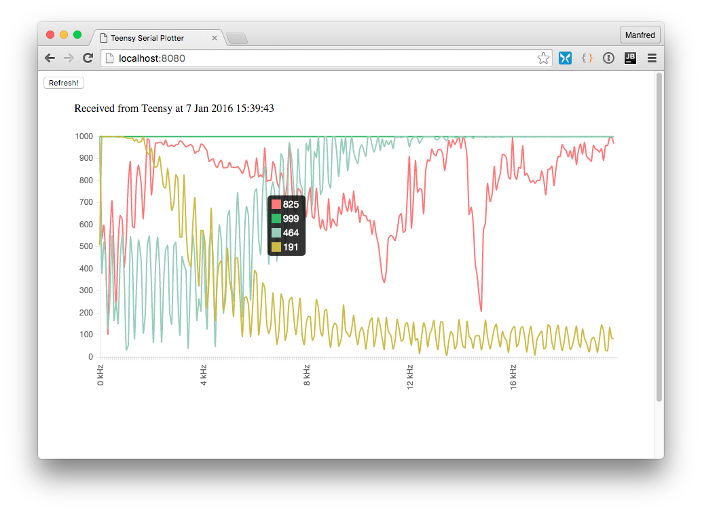

# Monitor.js
Monitors and visualize data received via USB (Arduino/Teensy)

##About
This Node.js module script is freely inspired by the Arduino IDE and its "Serial Plotter".

##License
This script is under the MIT License. See LICENSE file

##Requirements
The visualizer of the Arduino IDE is smomewhat rudimentary and slow - and also only to be handled withs some hack, if you want to use the "Serial Plotter" as visualization of data - without always scroling to the left when entering new data.

So I wrote a _Node-Module_ called monitor.js, which looks for serial data coming in over the specified USB-port and format this data as plain text and provides it as a little web server with the possibility to visualize the data in individual charts in the browser. Like in this screenshot:



The node.js module provides all needed files to visualize the data in the browser, so after installing the module, you only need the browser of your choice an the you may collect the data from your embedded system and visualize it.

##What you need:
* All you find here in the package ([Chart.js](https://github.com/nnnick/Chart.js) is included)
* node.js and some packages (express, serialport - will be installed automatically)
* and, of course, an USB port which feeds your monitor with data

##Ok, let's begin
After cloning the branch you change into the branch's directory and type *npm install*. So all needed packages will be installed by the package manager from node.js.

Then you start the monitor web server like this:

      sudo node monitor.js <usb device name> <baudrate> <port> [-v]
      
      * unfortunately, on Mac OS X the tool must run as root, if not, no reading of the USB port is possible (looking for a solution) 
      * <usb device name> - the name of the USB port, where the Arduino or Teensy board is attached.
      * <baudrate> - the rate you set for the serial monitor
      * <port> - Port of the web server, on which you may receive the visualization
      * optinal -v - Verbose mode, the tool will log a lot on <stdout>
      
Now you may open your browser with the address http://localhost:<port>/index.html. If all parmeters where right and your embedded system is protocolling over the serial port, you should see something resembling to the screenshot above.

##ToDo: 
* allow to change the visualization settings
* expand the "monitoring" protocol for remalrs, titles etc.
* generalize the data parser, scan how many datasets are used and adapt the settings
* ...

##The "protocol":

your embedded system should be sending the data via *"Serial.prinln()"* to the USB port, resembling the way you feed the Serial Plotter.

```
GRAPH-START
637,999,1000,206
625,999,993,135
625,999,994,208
647,999,927,126
684,999,920,112
640,999,882,38
621,999,994,45
591,999,943,98
590,999,1000,130
604,999,1000,211
584,999,984,188
600,999,987,90
...
544,999,954,100
569,999,901,82
555,999,903,9
582,999,1000,69
482,999,1000,107
584,999,963,186
568,999,977,198
402,999,953,172
419,999,955,138
350,999,988,72
278,999,937,50
GRAPH-END
1452174855
```
The data transmission starts with *"GRAPH-START"* and ends with *"GRAPH-END"*, followed by a line wiht the UNIX timestap of the moment, the data was received by the monitor. In between, you find the data as 4-values-comma-separated packets, because this version looks staticakky for four values per line. And the system needs (!) 500 lines of values between start and end, this is statically fixed for the moment, but will be changed in the future.


